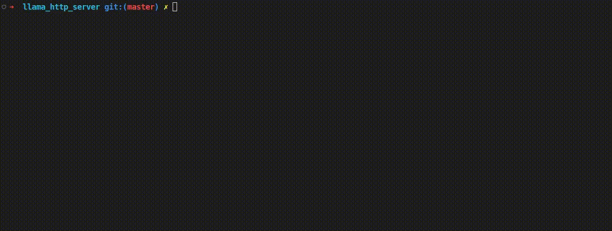

# llama-saas
A real-time client and server for LLaMA (Large Language Model Meta AI) that can run ANYWHERE.<br>
The server is minimal and written in Go, while the client is written in python<br>
I personally used the 7B model (~4.8G quantized, ~13G in full percision)

# Examples
- Nice one: 


- Biased one:


### Get LLaMA Pretrained Checkpoints
Note that LLaMA <a href="https://ai.facebook.com/blog/large-language-model-llama-meta-ai/">cannot be used for commercial use</a>.
- > To maintain integrity and prevent misuse, we are releasing our model under a noncommercial license focused on research use cases. Access to the model will be granted on a case-by-case basis to academic researchers; those affiliated with organizations in government, civil society, and academia; and industry research laboratories around the world. People interested in applying for access can find the link to the application in our research paper.

1. Apply for <a href="https://docs.google.com/forms/d/e/1FAIpQLSfqNECQnMkycAp2jP4Z9TFX0cGR4uf7b_fBxjY_OjhJILlKGA/viewform">Official Access</a>. You will get a unique download link once you are approved.
2. Alternatively, without any gurantee - You can try downloading it from https://github.com/shawwn/llama-dl (Not Recommended, haven't tried it).

# How to use
Assuming you have the LLaMA checkpoints
1. Clone and build https://github.com/ggerganov/llama.cpp
2. Edit the `LLAMA_MODEL_PATH` and `LLAMA_MAIN` variables in `server.go`.
3. Build and run the server: 
```shell
go build
./server
```
4. Run the client:
```shell
python3 -m pip install requests
python3 llama.py
```

## References
1. https://ai.facebook.com/blog/large-language-model-llama-meta-ai/
2. https://github.com/ggerganov/llama.cpp


